# 識別性能の検証結果

## 概要

顔写真を8名に分類するタスクでモデルの性能検証を行った。  
今回検証した2種類のモデルでは、フィルタ数に関わらず転移学習を行うことで正答率が向上することが確認された。また、フィルタ数を多く設定するとFaceClassifier100x100Aでは収束が遅くなり、FaceClassifier100x100I2では過学習しやすくなる傾向が見られたが、転移学習によりどちらの問題も緩和されることが確認された。

## 目次

* [問題設定](#問題設定)
    - [データセット](#データセット)
    - [検証対象モデル](#検証対象モデル)
    - [検証内容](#検証内容)
    - [事前学習](#事前学習)
* [検証結果](#検証結果)
* [備考: 転移学習に用いたデータに対する識別性能](#備考転移学習に用いたデータに対する識別性能)

## 問題設定

顔写真から人を特定するタスク

### データセット

下記8名の写真を[Yahoo!画像検索で収集](./collect-imgs.md#yahoo画像検索を使う場合)し[顔の部分を切り出し](./create-dataset.md)て作成した、8クラス292枚の顔写真を用いる。データセットそのものは、肖像権と著作権の問題から公開しない。

```TSV
0	武井咲
1	中越典子
2	ケンドーコバヤシ
3	伊原剛志
4	小蜜
5	照英
6	壇蜜
7	木村祐一
```

### 検証対象モデル

* [FaceClassifier100x100A](../cnn_models.py#L177) (以下、モデルAと記載)
    - 一般的なCNNの実装
    - n_base_unit: 8, 16, 32 の3パターン
    - 転移学習: あり, なし の2パターン
* [FaceClassifier100x100I2](../cnn_models.py#L21) (以下、モデルI2と記載)
    - Inceptionモジュールを使用したCNNの実装
    - n_base_unit: 4, 8, 16, 24, 32　の5パターン
    - 転移学習: あり, なし の2パターン

### 検証内容

* 1
    - データセットを 訓練データ:評価データ = 7:3 の割合でランダムに振り分け、訓練データのみで学習させる。
    - 学習した識別モデルの、評価データに対する正答率を見る。
    - 学習を50epoch行う間の訓練データ、評価データそれぞれに対する正答率の推移から、収束の速さと過学習の傾向を見る。
* 2
    - 検証項目1の訓練データと評価データを逆転させて同様の検証を行い、訓練データが少ない場合の識別性能を確認する。

### 転移学習

[Google画像検索で収集](./collect-imgs.md#google画像検索を使う場合)した48135個の画像URLを元に、120クラス16576枚の学習データを作った。このデータを200epoch学習させた後、畳み込み層の重みは固定し、結合層だけを分類対象のデータセットで再学習させた。なお、分類対象とする8名は、この120名には含まれていない。  
転移学習に用いたデータセットについても、肖像権と著作権の問題から公開しない。

## 検証結果

誤差も含めた詳細な数値は[スプレッドシートに掲載](./performance-detail.ods)している。

### 検証1 訓練データが多い場合

モデルAの正答率の推移を以下に示す。  
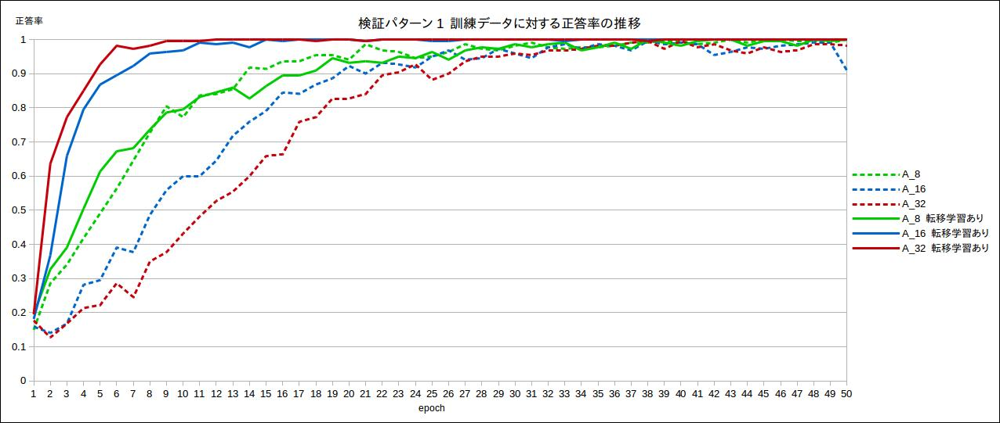  
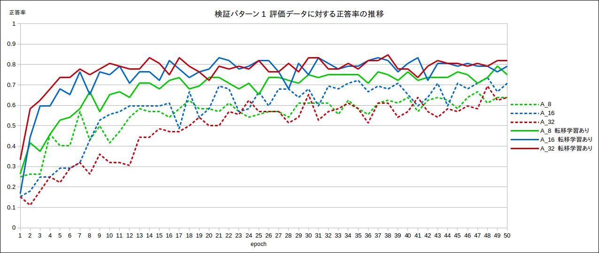  
転移学習を行わない場合はフィルタ数が多いほど収束が遅い。50epoch終了時点で評価データに対する正答率は転移学習を行わない場合と比べて低いが上昇傾向にあり、以降も学習を続けることで差が縮まる可能性がある。  
転移学習を行うと、フィルタ数が多い場合の収束の遅さが大きく改善され、逆にフィルタ数が多いほうが収束が速くなる。また、50epochまでの範囲では転移学習を行ったほうが正答率が高い。

モデルI2の正答率の推移を以下に示す。
  
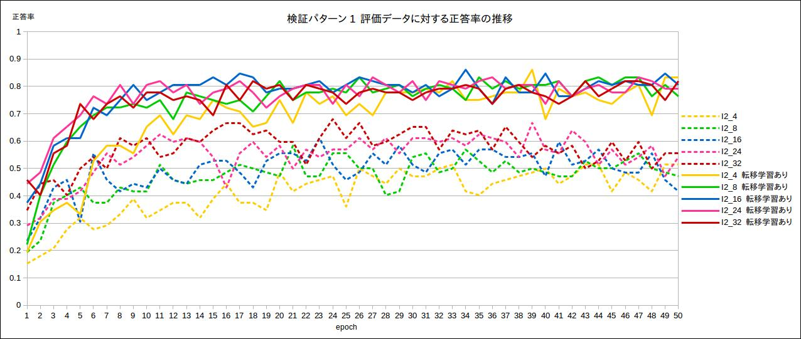  
モデルI2については、フィルタ数が多いほど収束が速い傾向が見られる。モデルAとは異なり、転移学習を行っても収束は高速化しない。  
転移学習を行わない場合はフィルタ数が多いと過学習が顕著になり、40epoch以降に評価データに対する正答率が低下傾向となっている。転移学習を行った場合は正答率の低下は発生せず、正答率そのものも高い。

### 検証2 訓練データが少ない場合

モデルAの正答率の推移を以下に示す。  
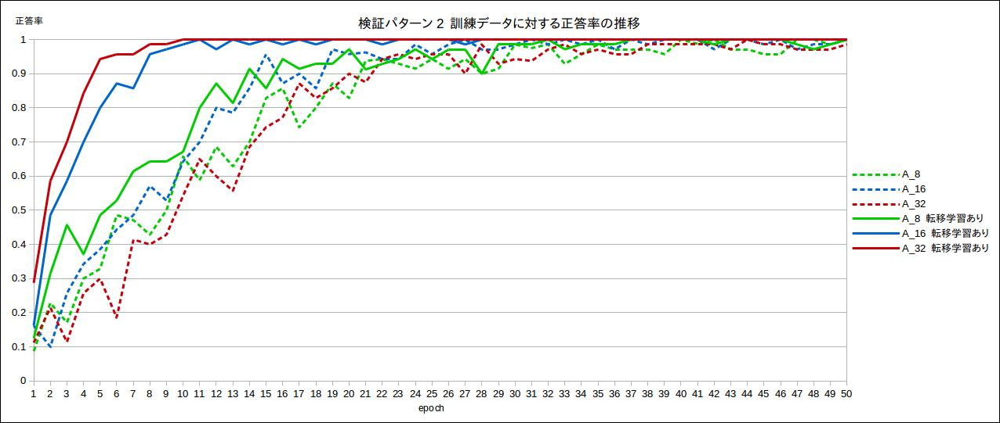  
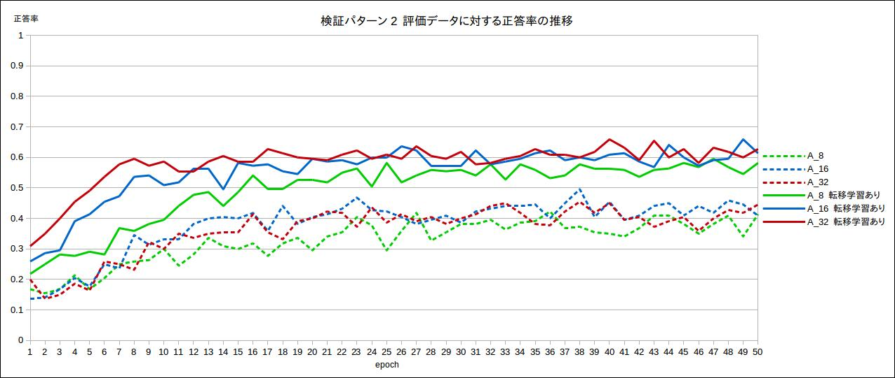  
検証1と同様、転移学習を行うことでフィルタ数が多い場合の収束速度が改善する。評価データに対する正答率も高い。

モデルI2の正答率の推移を以下に示す。
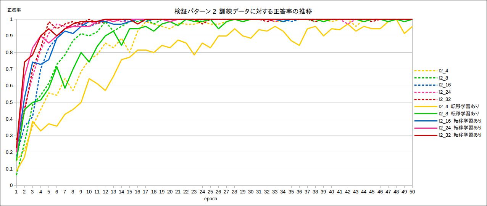  
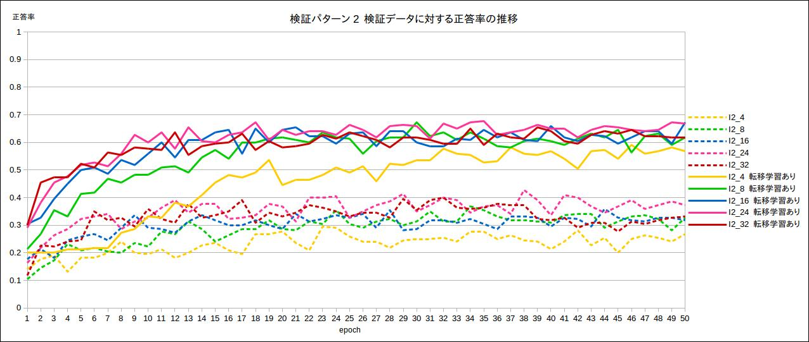  
検証2と同様、転移学習による収束の高速化は見られず、フィルタ数の最も少ないパターンでは収束が遅くなっている。ただし、評価データに対する正答率はフィルタ数によらず転移学習を行ったほうが高い。

## 備考: 転移学習に用いたデータに対する識別性能

事前学習に用いた120クラス16576枚のデータについて、

* 全量を訓練に用いた場合の、訓練データに対する精度の推移
* 訓練8:評価2で分割した場合の、評価データに対する精度の推移

を掲載する。[pre_trained_models](./../pre_trained_models)に掲載されているのは、全量を訓練に用いた学習済みモデルである。
誤差も含めた詳細な数値は[スプレッドシートに掲載](./pre-train-detail.ods)している。

### 全量訓練時の訓練精度

基本的にはフィルタ数が多くネットワークが複雑になるほど精度が上がる傾向にある。  
200epoch終了時点では収束していないモデルが多く、特に最も複雑なモデルである`I2_32`ではそれが顕著である。学習を続けることで転移前の精度が向上する可能性が高く、転移後の精度も向上する可能性がある。

モデルA  
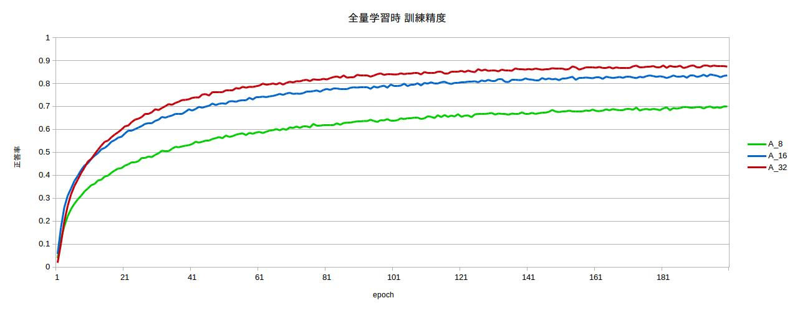

モデルI2  
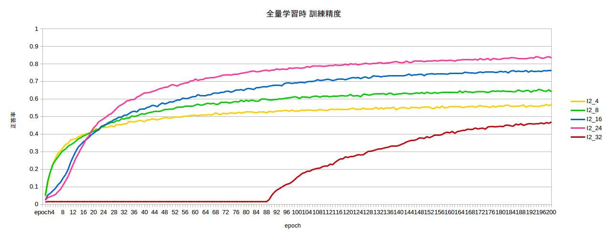

### 分割時の評価制度

最も正解率が高い`A_32`でも評価データにおける正答率は5割に満たない。本プロジェクトのモデルは、いずれも100名を超えるデータセットに対しては識別性能が不足していると言える。  
モデルAのほうが収束が速く、精度も高い傾向がある。モデルI2は`n_base_units`が16以上の場合に200epoch終了時点でも正答率が向上する途上であり、学習を続けることでより高い精度を得られた可能性がある。


モデルA  
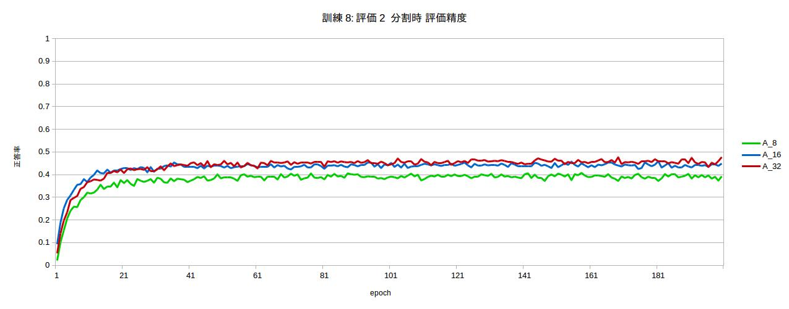

モデルI2  
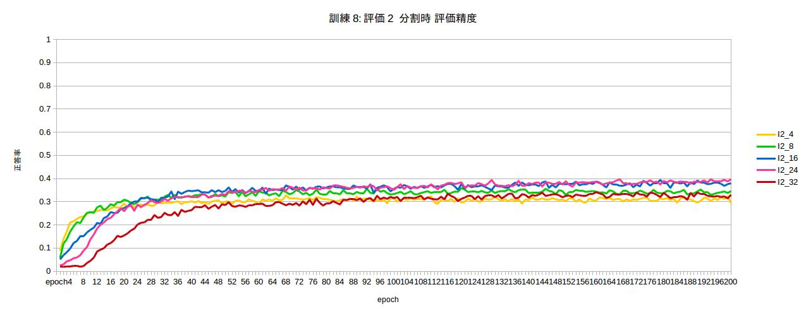
